# Release Management

### Step 1 - To add a Release Package, go to the Release Management menu and Click on Add Release button as shown below.

<figure>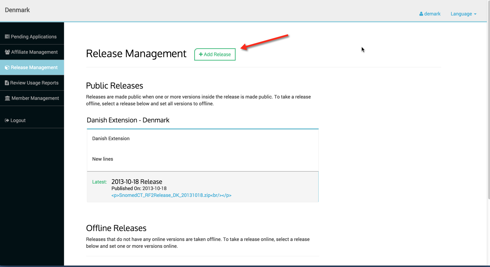<figcaption></figcaption></figure>

### Step 2 - Enter Release Package name and description.

<figure>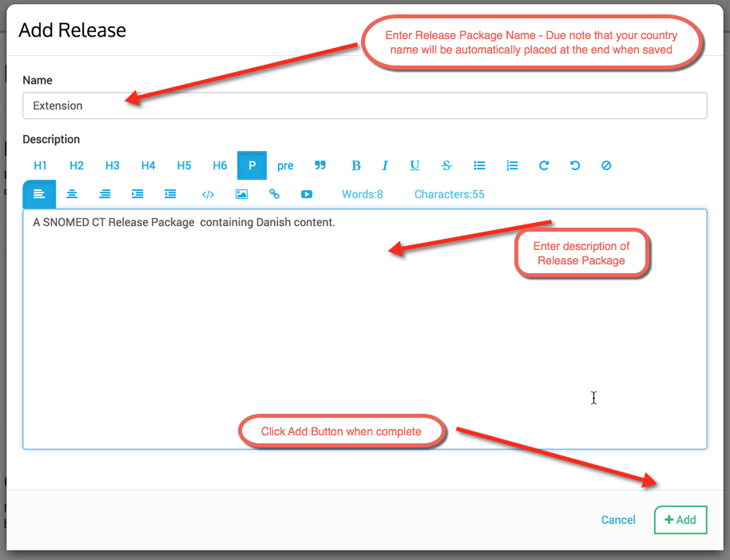<figcaption></figcaption></figure>

### Step 3 - Adding Versions to the Release Package

<figure>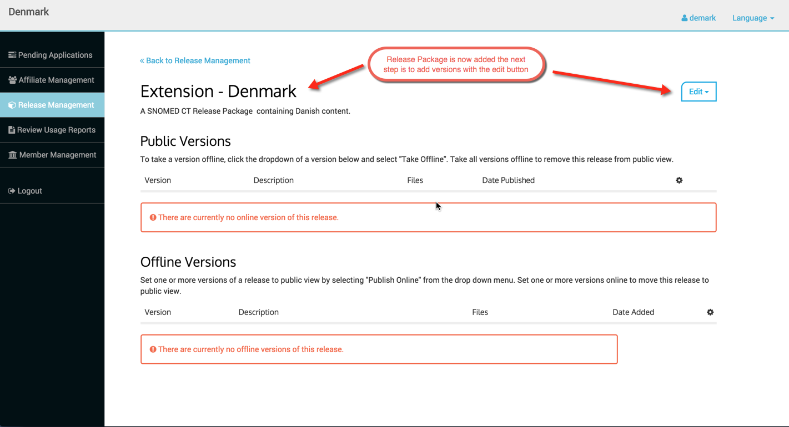<figcaption></figcaption></figure>

### Edit Menu - The edit menu has several options

* **Edit Package** - enables editing of Release Package name and description
* **View License** - enables viewing of the license for the Release Package selected, _note license must be uploaded via the Edit License option firs_ t
* **Edit License** - enables end user to upload a license for the Release Package selected
* **Add Version** - enables end user to add a version to the Release Package
* **Delete** - enables end user to delete the Release Package selected

<figure>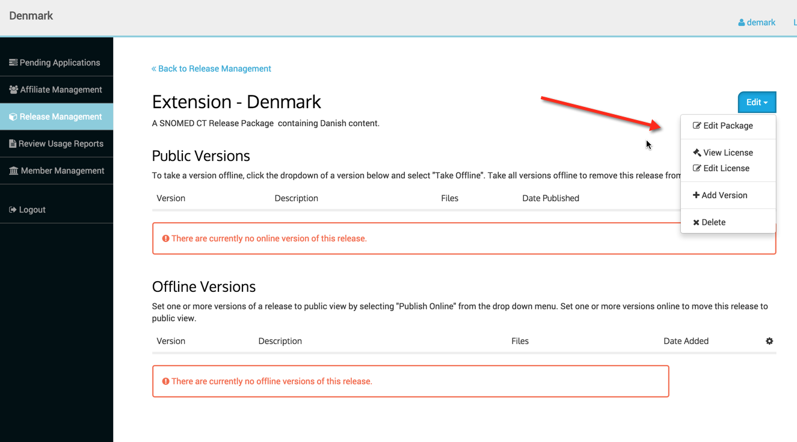<figcaption></figcaption></figure>

### Edit Package Option

Click Edit Package menu option, edit as desired and click update to complete.

<figure>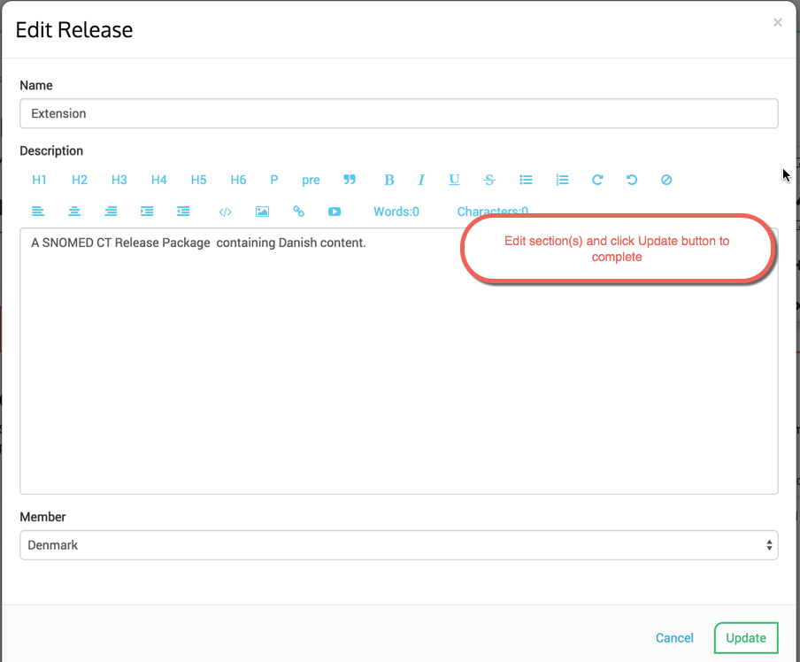<figcaption></figcaption></figure>

### View License Option

To view a license for the selected Release Package, click on View License and the license file will be downloaded to the end users local drive for viewing. The end user must use the Edit License option to add the license first.

### Edit License Option

### Step 1 - Add information as directed below and press save.

<figure>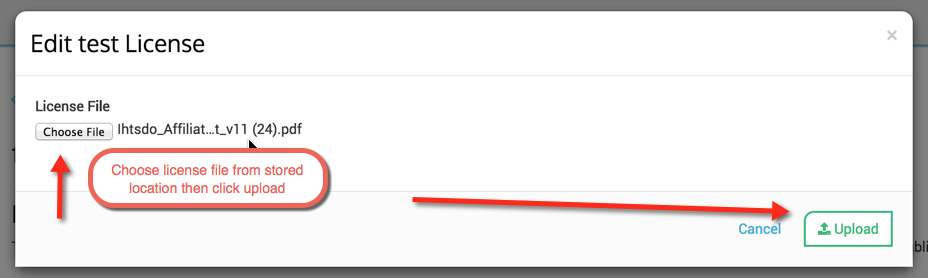<figcaption></figcaption></figure>

### Step 2 - Confirm Upload and Replace by clicking green button.

<figure>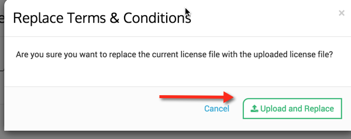<figcaption></figcaption></figure>

### Step 3 - New license file is confirmed and the end user will receive the below message

<figure>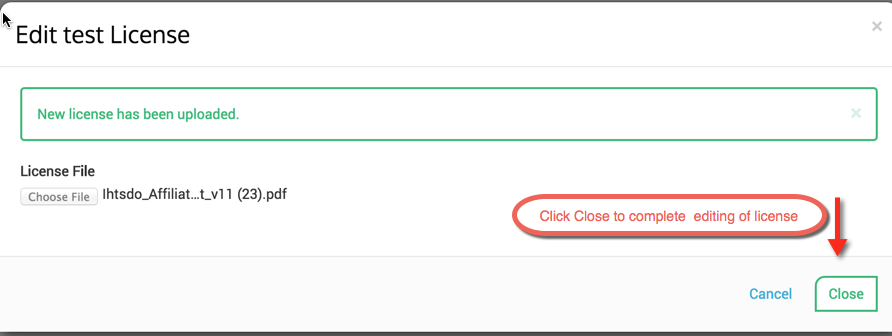<figcaption></figcaption></figure>

### ADD Version Option - Add information as directed below and press save.

<figure>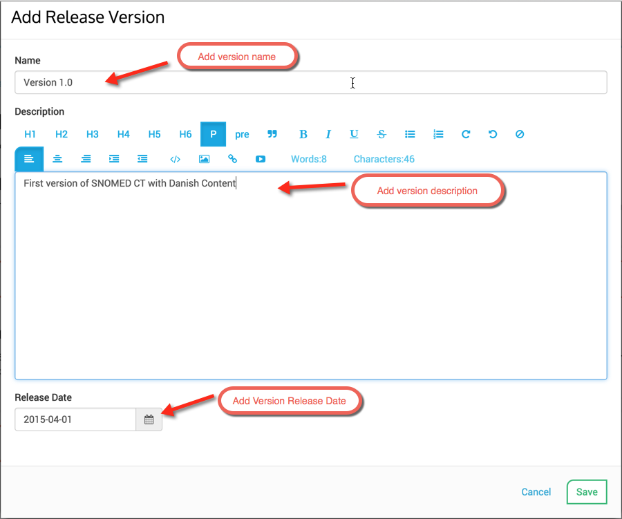<figcaption></figcaption></figure>

### Publishing a Release Package

Once the end user has added the Release Package, and added at least one version, they must Publish the Release Package in order for it to be Public.

<figure>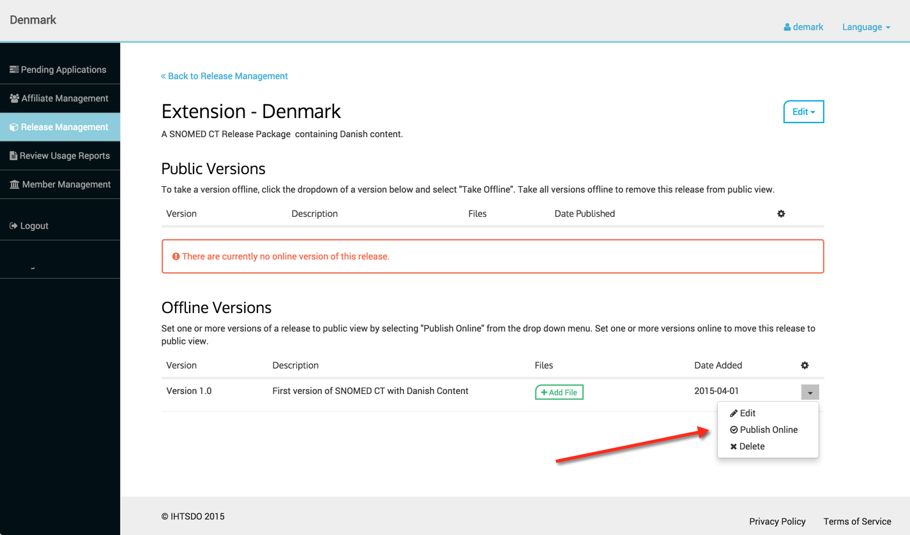<figcaption>
Click on Publish Online menu option and then Confirm Publishing message will appear, if it is the correct version to publish click Yes.
</figcaption></figure>

<figure>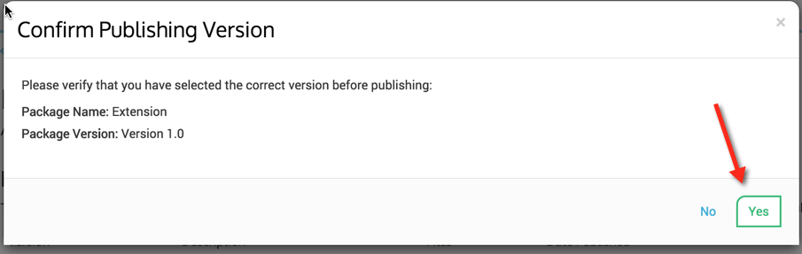<figcaption>
The version now appears under the <strong>Public Versions</strong> listing and is no longer Offline or NOT Public. Affiliates can now apply to access this Release Package.
</figcaption></figure>

<figure>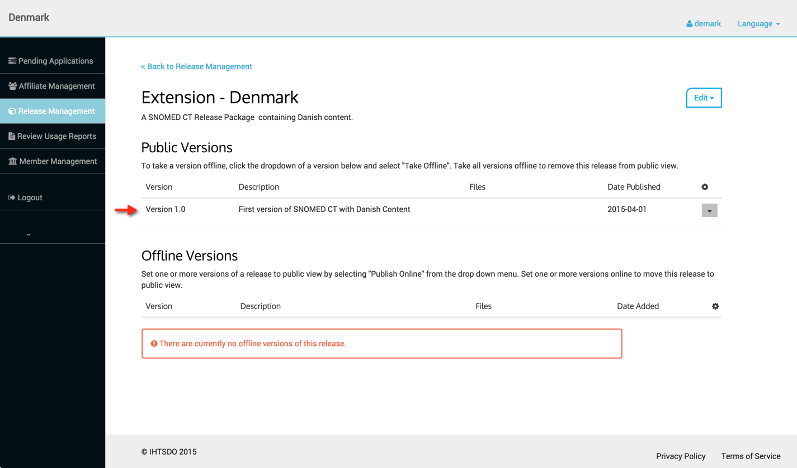<figcaption>
New menu options are now available for under the <strong>Public Versions</strong> section
</figcaption></figure>

* Edit - enables editing of Release Package name, description and release date
* Take Offline - enables the version to be removed from Public Access,

<figure><figcaption>
Once a version is "Taken Offline" it can remain offline or it can be deleted if desired by using the Delete option in the <strong>Offline Versions</strong> menu.
</figcaption></figure>

<figure>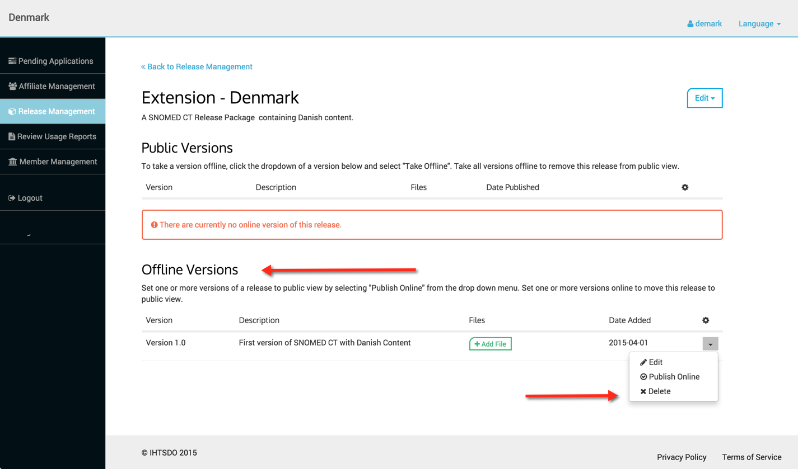<figcaption>
To access menus and options regarding Release Packages on the Release Management page, simply click on the Release Package name.
</figcaption></figure>

<figure>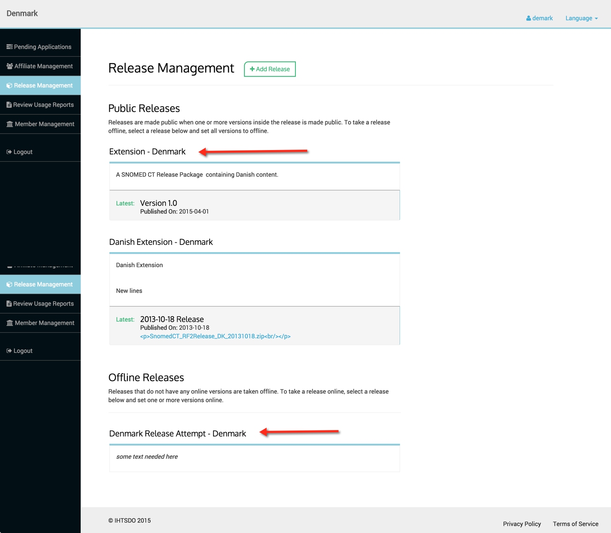<figcaption></figcaption></figure>

### Adding a file

To add a file, see the [Release Management Technical Details](../Release-Management-Technical-Details_3833906.html) page for more details.

**Page At A Glance**
