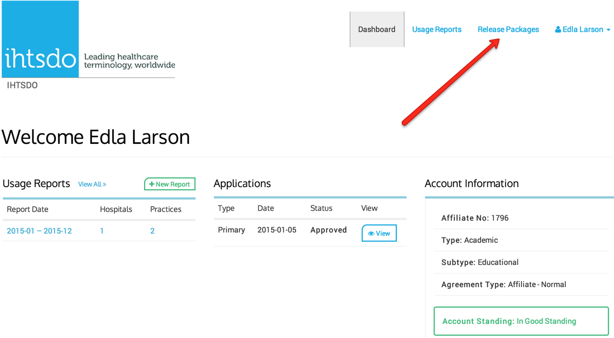
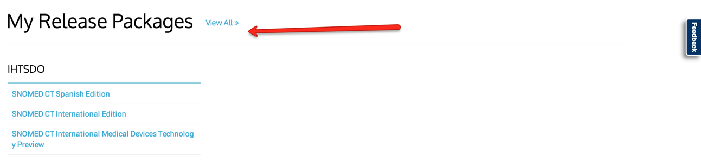
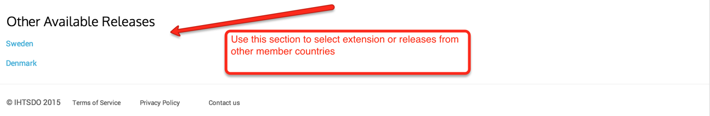
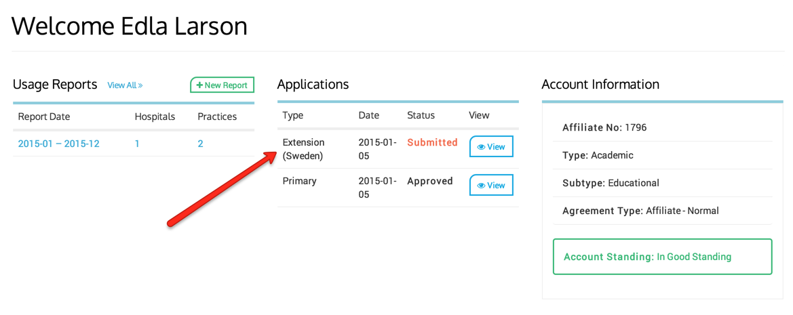

# Accessing releases

Once your account has been reviewed and, if applicable, any invoice has been paid, you will now be able to see that you application has been approved and your account will be in a 'good standing' process.

### Step 1. Access to SNOMED CT

* At this stage you will now have access to download the SNOMED CT International Release by clicking on the 'Releases' link on the top menu or the releases section on your dashboard.

<figure><figcaption></figcaption></figure>

<figure><figcaption></figcaption></figure>

### Step 2. Other Available Releases

* From your dashboard you can also apply for access to other products, such as national extensions. If you would like to apply to access any national Member space that can be found on the MLDS, you can click on the relevant country where you will be asked to provide information used by the member to review your application. Once approved by that country you will have access to the your selected release.

<figure><figcaption>
* You will notice that after you have applied for an extension or release from the selected country the section Applications will reflect the status of your Extension application. SNOMED CT is always your Primary application type.
</figcaption></figure>

<figure><figcaption></figcaption></figure>
