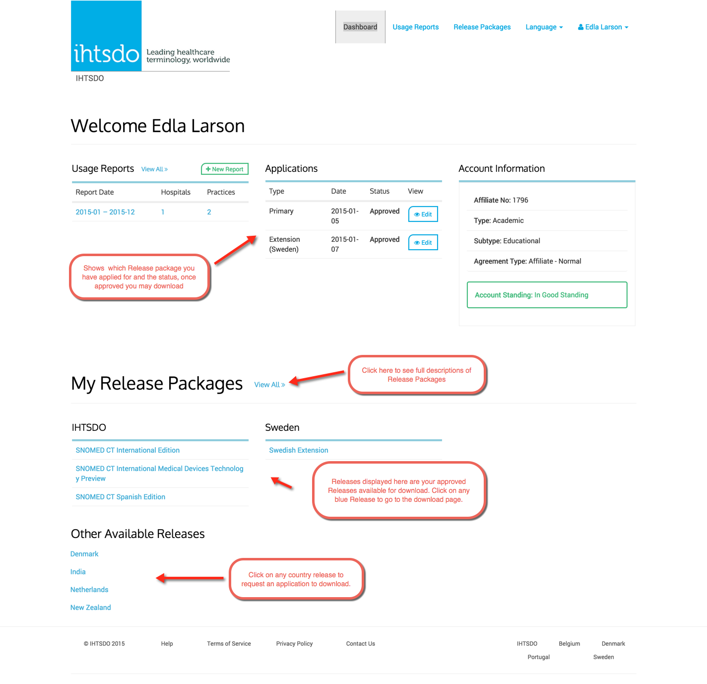
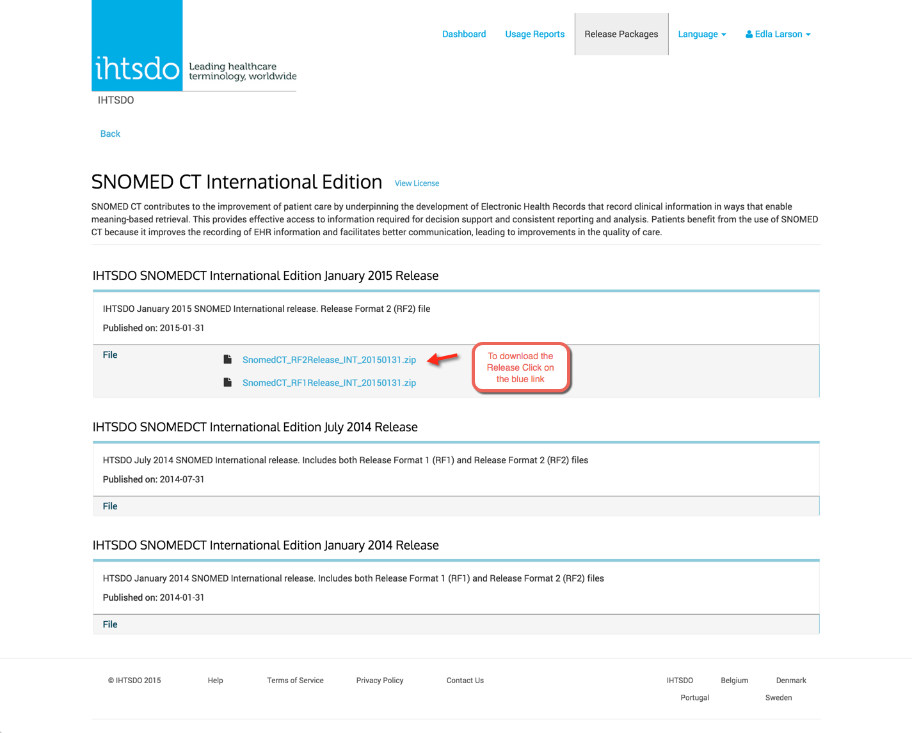
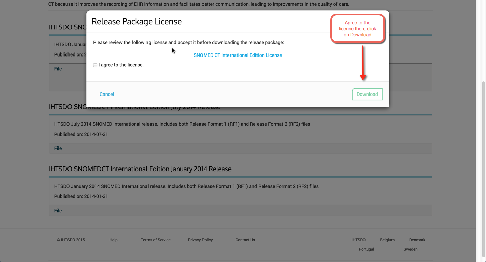
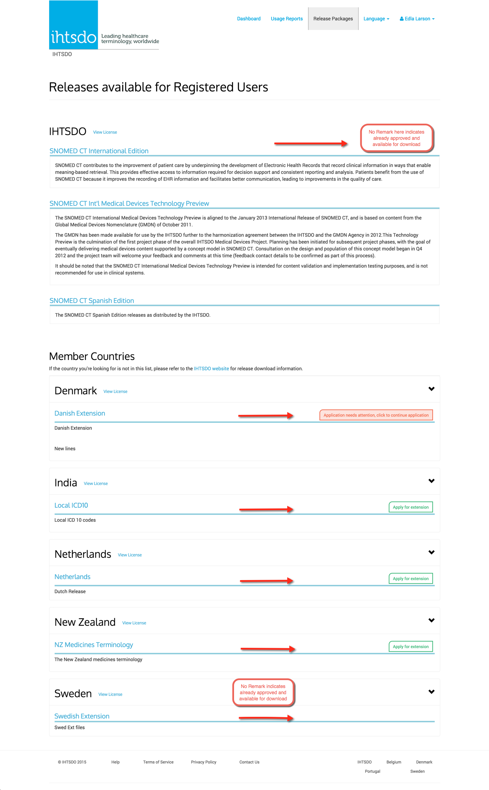

# Downloading releases
### IHTSDO Member - Dashboard Menu View or Release Package Menu View
### *Dashboard Menu View*
<figure><figcaption></figcaption></figure>
### Step 1. Once you have clicked on an approved release from the Dashboard view you will be brought to that specific Release Package with the ability to download.
<figure><figcaption></figcaption></figure>
### Step 2. Click on the checkbox to agree to the licence then you will be able to download the Release Package.
<figure><figcaption></figcaption></figure>
### *Release Package Menu View*
__
### Step 1 - Click on the Release Package that you wish to access.
__

_
⟦GITBOOK_FIG_3⟧ [Figure: _
]
### Step 2 - At this stage you can download an already approved Release Package or you can apply for any additional ones you want. Refer to the right of any Release Package for Status indication as explained below.
<figure><figcaption></figcaption></figure>
