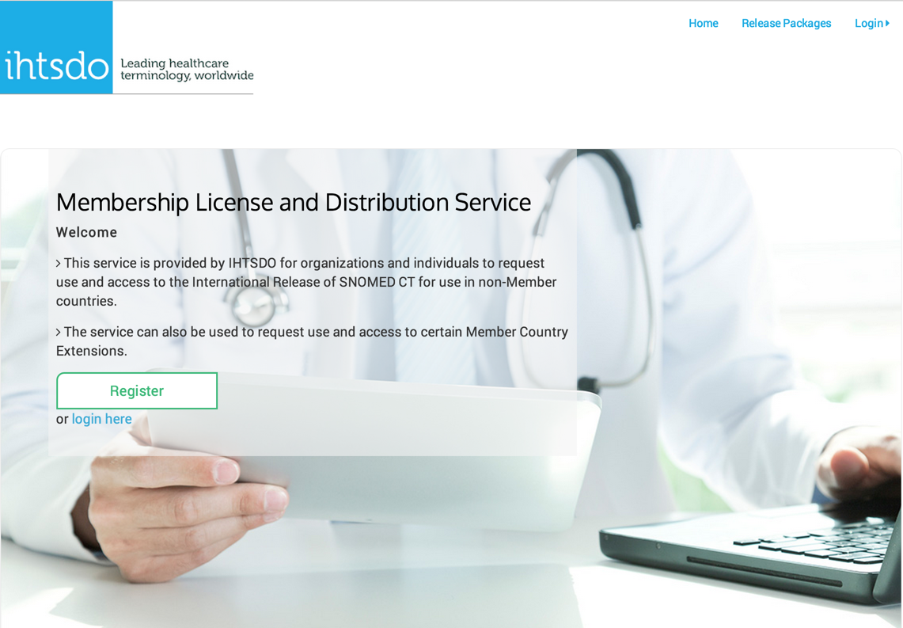
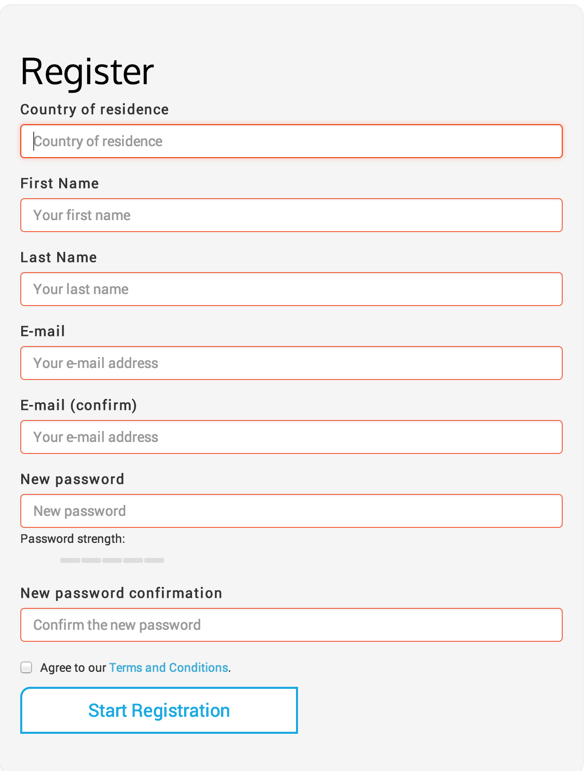
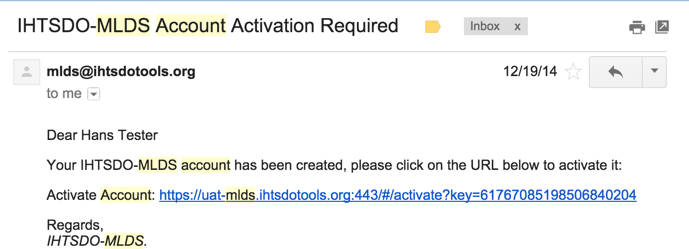
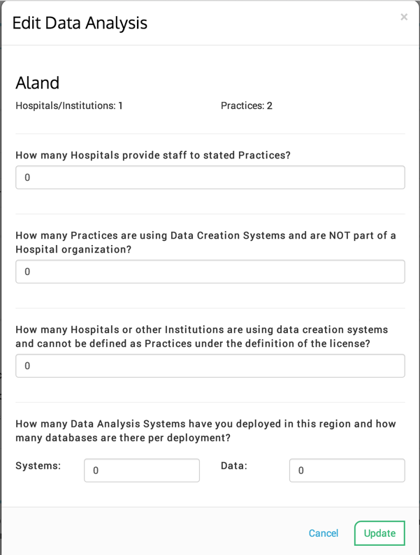
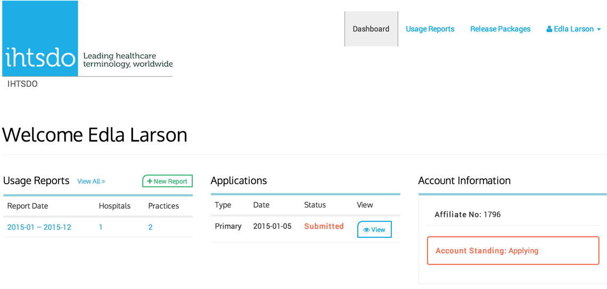
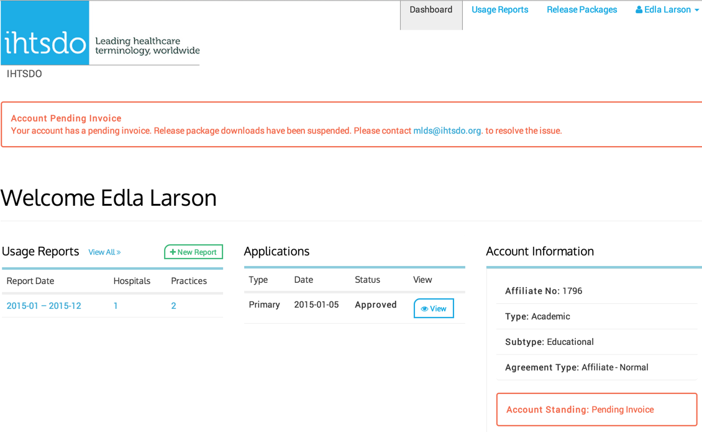

# Registration
- The landing page for affiliates looking to use SNOMED CT in non-member countries can be found here – [https://mlds.ihtsdotools.org](https://mlds.ihtsdotools.org)

<figure><figcaption></figcaption></figure>
### Step 1. Initial Registration
- Click on the Register button and you will be taken to the initial registration screen.

<figure><figcaption></figcaption></figure>
### Step 2. Account Activation
- Once you have completed the initial registration, you will be sent an Account Activation email to confirm your email address and allow you to continue your registration. In the email you receive, is the confirmation URL which will take you to the next step:

<figure><figcaption></figcaption></figure>
### Step 3. Registration Details
- You will be asked how you will be using SNOMED CT
  - Commercial
  - Academic
  - Individual
  - Other
- You will then be asked the type of your organization:
  - Developer
  - Development
  - Educational
  - Healthcare Provider
  - Personal
  - Research
  - Vendor
- Finally, you will be asked for the type of agreement:
  - Normal
  - Research
  - Public good.
- Next, you will be asked to provide information about yourself or your organization as well as a billing address (if applicable) for invoices to be sent.
- Your current and planned usage for the current year needs to be provided, along with a summary of the purpose of your SNOMED CT deployment and the status of implementation.
⟦GITBOOK_FIG_3⟧ [Figure: *The usage section then needs to be completed in order to get access to download SNOMED CT. You will be asked for the countries where the product will be used. Your Home Country that you have initially registered with will be automatically added, however you will need to select and add any other non-member country in which you plan to use SNOMED CT.*  You should only be able to select non-member countries at this stage. Currently you are able to select member countries, do note that this is a bug in the system which we are working on correcting. You should not enter any countries that are currently members of the IHTSDO._**
]

**_** &#xNAN;**_**
⟦GITBOOK_FIG_4⟧ [Figure: * The section below will be required information that will need to be provided for each country that you have selected.
]
⟦GITBOOK_FIG_5⟧ [Figure: *You will be asked for the names of hospitals where SCT will be deployed and dates that the product was started in use and, if applicable, ceased usage. Please note the start date of use is a*  mandatory _entry, you can add hospitals by clicking on the Add Hospital/Institution button which will take you to the entry screen below.
]
⟦GITBOOK_FIG_6⟧ [Figure: * You will also be asked for the number of practices (locations or premises) where SCT is in use (note that the practices do not have to be named, unlike for hospitals). You can add practices by clicking on the Edit Practices button which will take you to the entry screen below.
]
⟦GITBOOK_FIG_7⟧ [Figure: * Along with each Hospital or Practice that is entered there will also be a section related to Staffing and Data Analysis use, which you can access by clicking the Edit Data Analysis button. The following definitions apply to terms used on this form:
]

`*````Data````Creation````System````-````a````system````for````the````entry,````processing````and````storage````of````data.```
`*````Data````Analysis````System````-````a````system````for````the````collection,````organization,````analysis,````interpretation````and````presentation````of````data.```

<figure><figcaption></figcaption></figure>
### Step 4. Registration Details
- Any information that falls outside of the requested data should be recorded in the **Other Activities**  section. Affiliates are required to notify IHTSDO prior to engaging in any activities that do not fall within the existing categories at which time the IHTSDO will determine the appropriate Fee Structure for the activity in question
### Step 5. Final Registration Details
- The final section asks for you to confirm that you have read and accept the terms of the SNOMED CT affiliate license ([http://www.ihtsdo.org/resource/resource/117](http://www.ihtsdo.org/resource/resource/117) )before clicking the register button where you will be asked to confirm the information on your application before the final submission.
### Step 6. Dashboard
- At this point, you will now be redirected to your dashboard, where you will be able to see the status of your application and the standing of your account.

<figure><figcaption></figcaption></figure>
### Step 7. Account Status
- Once your application has been reviewed and approved your Account Information Status will change to Pending Invoice as shown below.

<figure><figcaption></figcaption></figure>
### Step 8. Full Access
- Once your invoice is paid, your Account Information Status will change to **In Good Standing**  and you will be able to access the SNOMED CT Releases as well as any other extensions or other files that are available.
