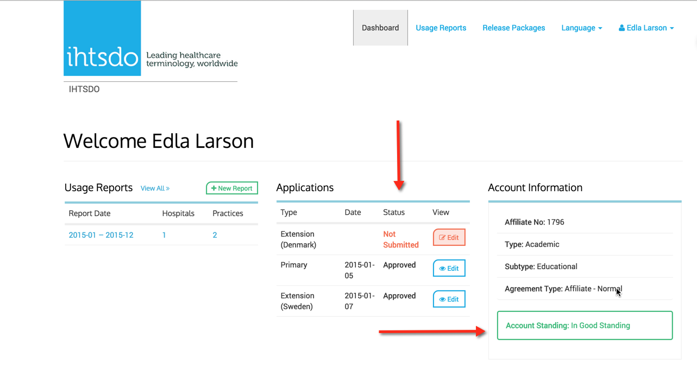

# Application and Account Status Meanings

### Application Status

  1. Approved - Application is approved.
  2. Declined - Application is declined.
  3. Change Requested - An Action has been sent to the Affilate to comply and is under further review before approval is granted.

### Account Status

  1. In Good Standing \- Affiliate is approved they have paid or they have been Re-activated, they have complete access.
  2. Pending Invoice - Affiliate has access to the account but can not download, once payment is received, Admin places account In Good Standing.
  3. De-Activation Pending \- Flags an Affiliate account but they can not download releases, they have a certain time to respond to an IHTSDO action. They have access to their account.
  4. De-Activated \- Affiliate Account is De-Activated for failure of payment or other infraction; they have no Access to download and have no access to their MLDS account. The reason for De-activation is noted to Affiliate.

  

<figure></figure>
