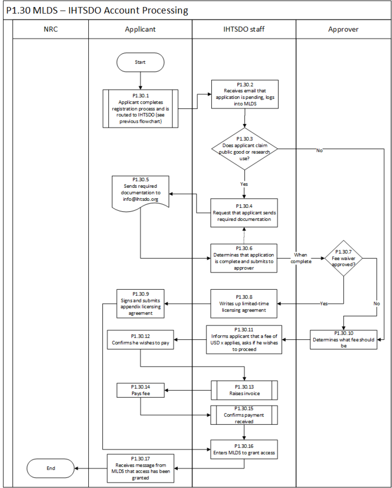

# Application Process

When new account applications arrive for IHTSDO processing in MLDS, they are either fee-waiver requests (for research or public good), or they are commercial requests where a fee will be charged.

The process diagram below shows how the two types of account requests are processed.

<figure><figcaption></figcaption></figure>
