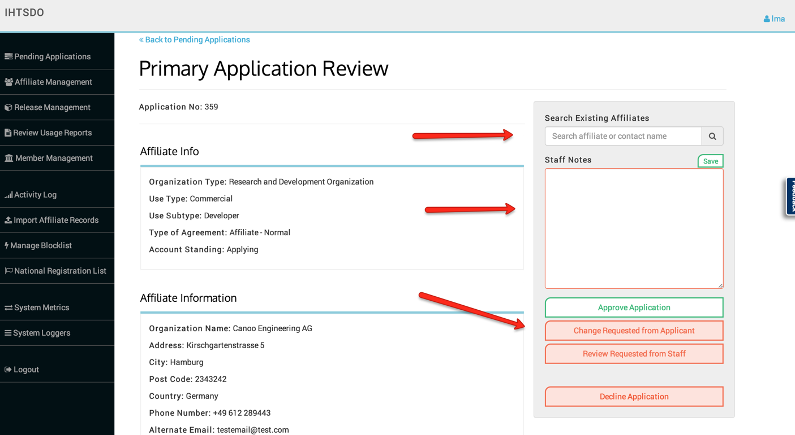
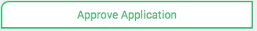
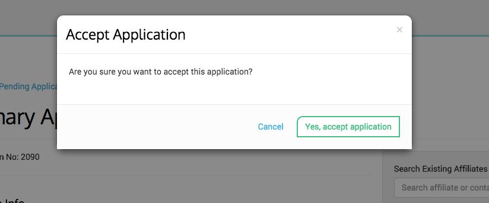
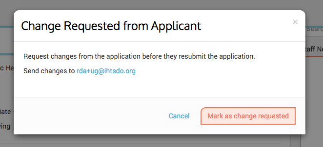
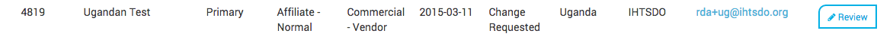
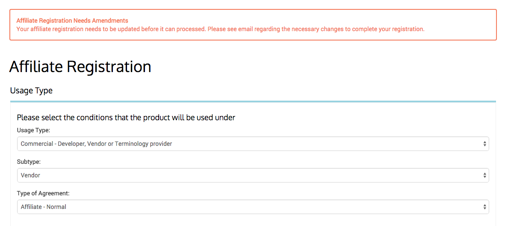
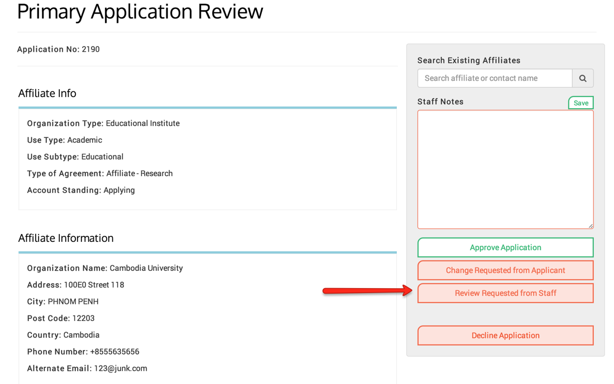
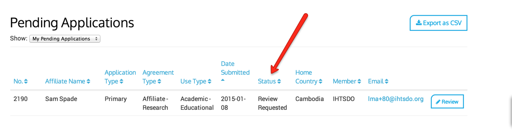
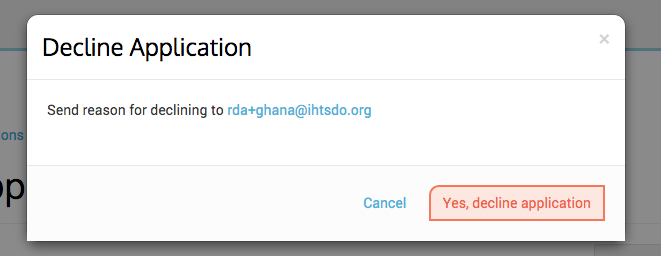
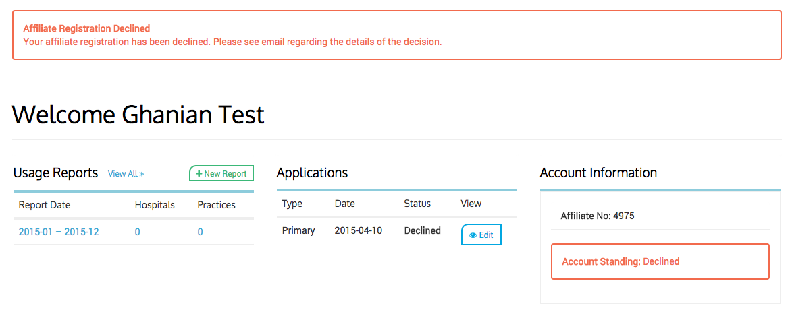

# Pending Applications

Here is where you will find any new applications that are waiting to be approved. Click on the Review Button where you will be able to review the application (step1 )and then decide (step 2) if the application can be approved, declined or if you wish to request additional information from the Affiliate.

## List of Applications

<figure></figure>

## Actions available on an application page

<figure><figcaption>
<em> </em> *
</figcaption></figure>

### Approve Application

If the everything on the application is acceptable and you wish to approve the application, click the 

<figure><figcaption>
button.
</figcaption></figure>

You will then see the following dialog box:

<figure><figcaption>
You can either cancel or accept the application by clicking the respective button. On acceptance, an email will be sent to the affiliate informing them that their application has been approved. The Affiliate will now be able to download the International SNOMED CT Edition and any local release packages that you have made available.
</figcaption></figure>

You can now find that affiliate in the Affiliate Management Page.

* * *

### Change Requested

If, having reviewed the application, more information or changes are needed from the applicant, then Admin can click on the "Change Requested From Applicant" button. This will result in the following dialog box:

<figure><figcaption>
This will allow you the Admin to send an email to the applicant, using an external email client such as MS Outlook, to inform the applicant that they need to make some changes to their application. It is important to note that without sending an email directly to the affiliate, they will <strong>not</strong> be notified of any change in their application (i.e. they will not receive any notification email from the MLDS system). This is because they must be informed of the changes that they need to make.
</figcaption></figure>

  

The application will be shown with a 'Change Requested' status in the Pending Applications screen as follows:

<figure><figcaption>
The next time that the affiliate logs in to MLDS, they will see the following screen which tells them that they need to amend their application:
</figcaption></figure>

<figure><figcaption>
Until they have made changes and <strong>re-submitted</strong> the application, Admin will not be able to approve the application.
</figcaption></figure>

* * *

### Review Requested

When further review of an application is required, the Admin can click the Review Requested from Staff button to flag that application. This button _does not work_ like an on and off flag. In order to remove the Review Requested flag the application must be Approved, a Change Requested from Applicant issued or the application should be Declined.

  

<figure><figcaption>
* The application will now reflect a Status of Review Requested.
</figcaption></figure>

  

  

<figure><figcaption>
<em> </em> *
</figcaption></figure>

  

### Decline Application

If, for whatever reason the application is not approved then Admin should click on the 'Decline Application' button. This will show the following confirmation dialog box:

<figure><figcaption>
To provide more details of why their application has been declined, click on the email to open up your email client in order to send the details to the applicant. To then confirm that Admin wishes to decline the application, click on the 'Yes, decline application' button. As with requesting changes, it is important to note that without sending an email directly to the affiliate, they will <strong>not</strong> be notified of their application being denied (i.e. they will not receive any notification email from the MLDS system). It is the decision of the user whether they need to be informed of the reasons for the decision.
</figcaption></figure>

This will change the status of the application to declined and the applicant will see the following screen when they log in:

<figure></figure>

  

