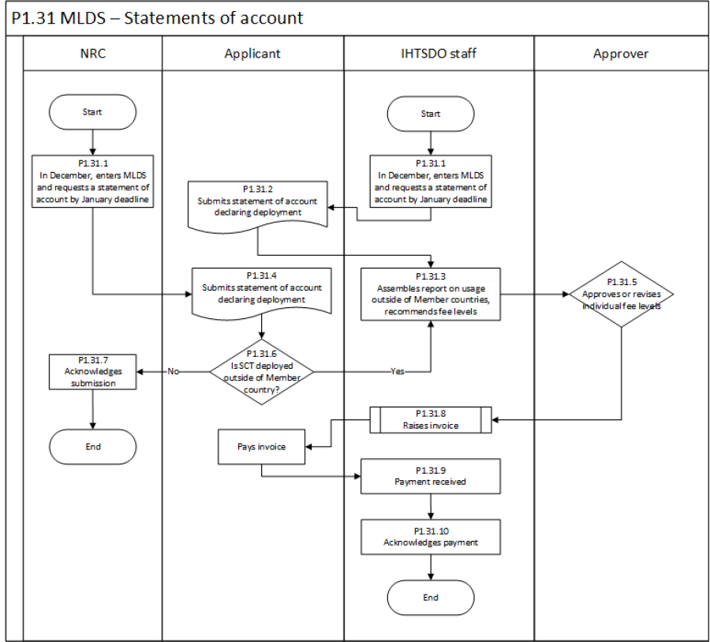

# Usage Reports / Statements of Account

Once a year in December (not every 6 months, as in the past), IHTSDO and NRCs will use MLDS to request statements of account. These statements are intended to collect information about how SNOMED CT is being used, particularly about whether Affiliate fees need to be charged for deploying outside a Member country.

<figure><figcaption></figcaption></figure>
