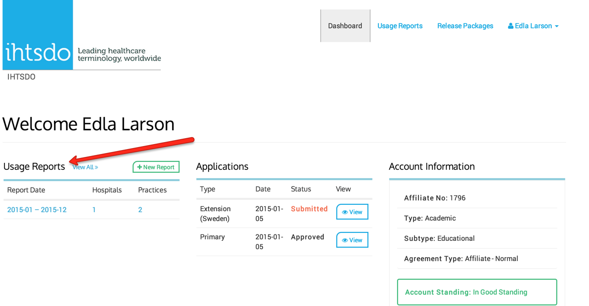
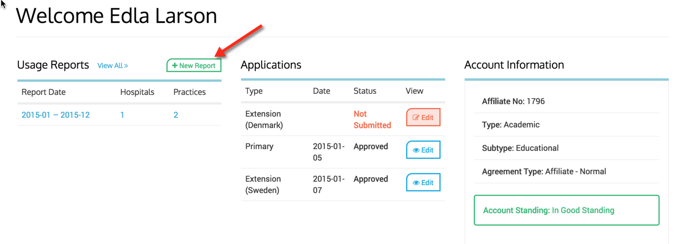
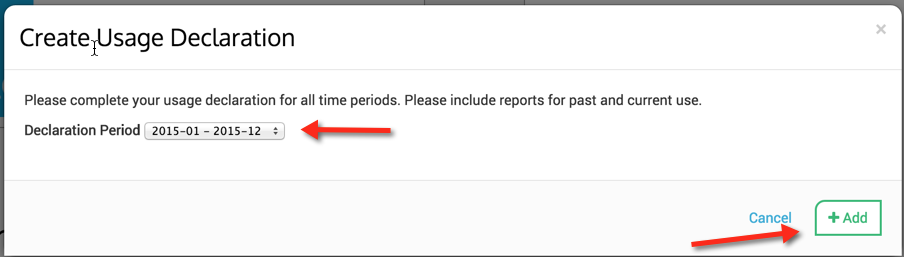
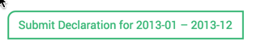
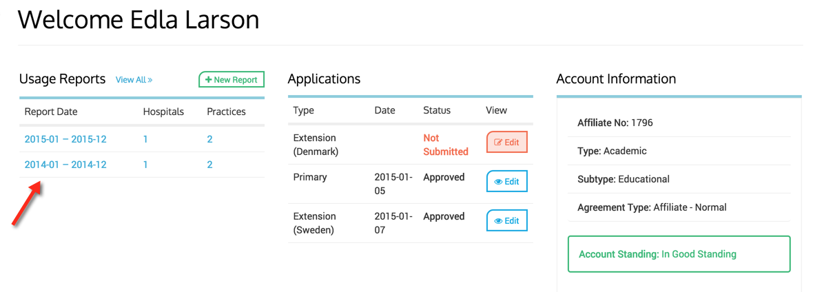
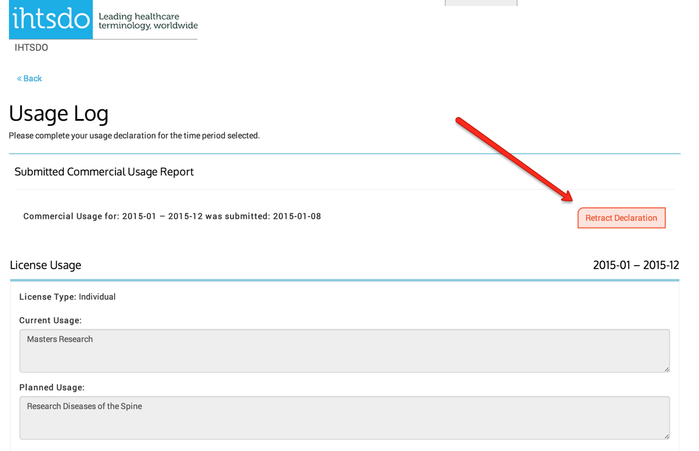

# Usage Reports

  1. ### New Usage Declaration Reports

When an Affiliate completes their application, the usage report can be filled out without completing all of the information. The IHTSDO or Member NRC admin reviews the application and will request additional usage information be completed if required. The Affiliate will see reminder messages that indicate when reports need to be submitted.

After the initial usage report submission, towards the end of every year, and if applicable, the Affiliate will receive a notification via email that they need to provide a report on the current and planned usage of SNOMED CT in non-member countries, and any member countries they have registered with through the MLDS.

  * On your dashboard you will see your previously submitted usage reports, as well as where to create a new usage report.

<figure><figcaption>
* Once you have completed your usage report and it has been submitted, it will be reviewed by IHTSDO staff and, where applicable, an invoice will be sent to you. At this point, your account will be in a 'pending payment' status where you will be unable to download SCT until payment has been received.
</figcaption></figure>

  
  

### 2\. Create a Usage Declaration Report

  * Click on New Report button.  
  

<figure><figcaption>
* Add the time period for the declaration year and click Add button.
</figcaption></figure>

<figure><figcaption>
* Complete the form and please be aware that the form will use the default values of the previously submitted report, make sure to edit accordingly for accuracy of use in the year you are reporting. Remember to click on the Submit Declaration button as show below, located in the bottom left of form page, when you are finished editing the year.
</figcaption></figure>

<figure><figcaption>
* Once Submitted you will see your newly added report in the Usage Report list.
</figcaption></figure>

<figure></figure>

### 3.Retract a Usage Declaration Report

If for some reason an affiliate wants to correct a usage report that has been submitted, they must first retract the usage report. They can do this by clicking on the usage report they wish to change and then click the Retract Declaration Button. They can then amend their changes and submit. Any previously submitted Usage reports for the same time period will be superseded.

<figure></figure>
